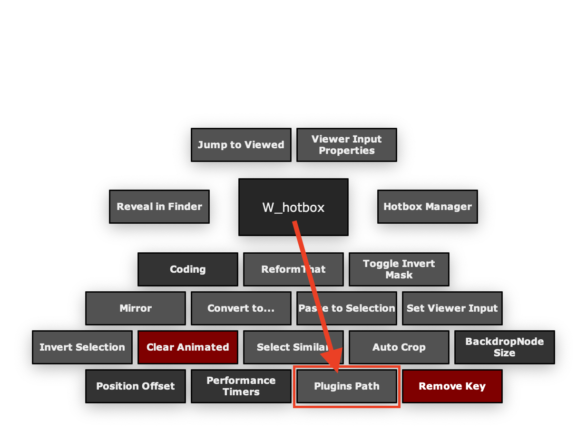

<h1 align='center'>
  pluginsPath
</h1>

## Introduce
Search a gizmo path using keywords or from selected node.

<br />

## Usage
> Required: Nuke 12 or later

Select gizmo and run the script.

<br />

## Installation

### Method 1:

`init.py`

```python
nuke.pluginAddPath('./PythonScripts/pluginsPath')
```

`menu.py`

```python
import nuke
import pluginsPath

s = nuke.menu("Nuke").addMenu("PythonScripts")
s.addCommand('Plugins Path'，'pluginsPath.PluginsPath().showModal()')
```

### Method 2

You can directly install the [PythonScripts Toolkit for Nuke](https://github.com/isLundy/Nuke-PythonScripts-Toolkit.git), it shows in the `W_hotbox`.



