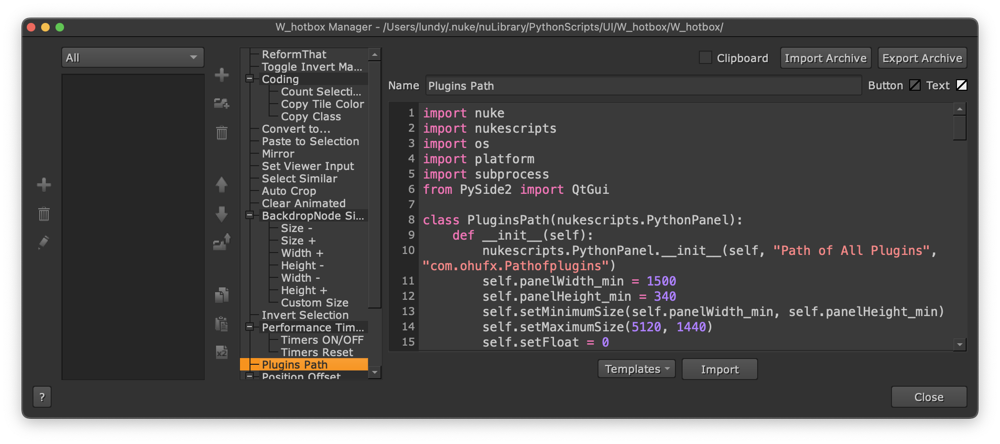

<h1 align='center'>
  pluginsPath
</h1>

## Introduce
Search a gizmo path using keywords or from selected node.

 

## Usage
> Required: Nuke 12 or later

Select gizmo and run the script.

 

## Installation
You can install this script in your own way.

Alternatively, you can directly install the [PythonScripts Toolkit for Nuke](https://github.com/isLundy/Nuke-PythonScripts-Toolkit.git), where the script shows in the W_hotbox.

